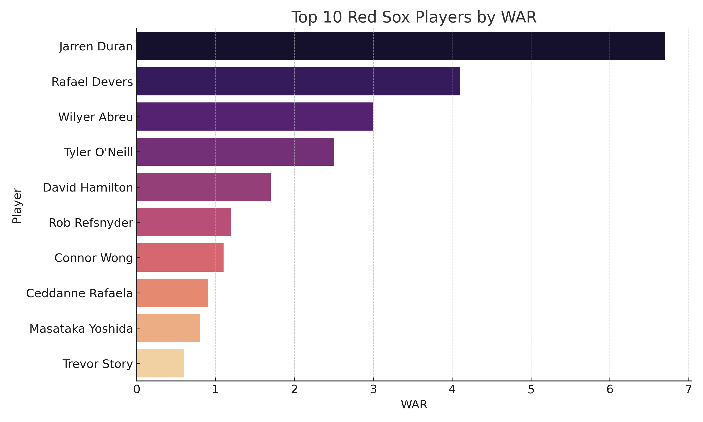
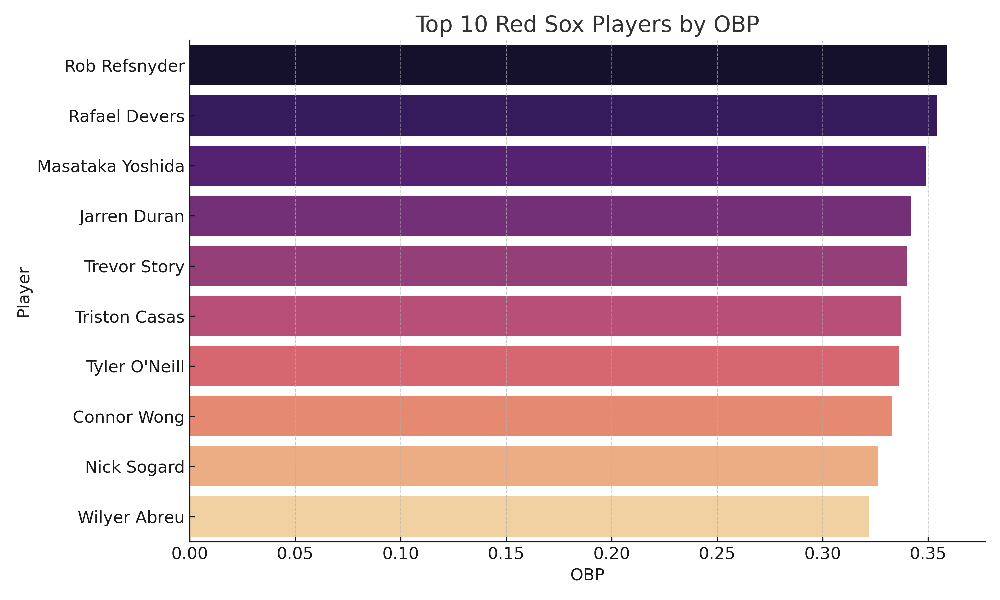
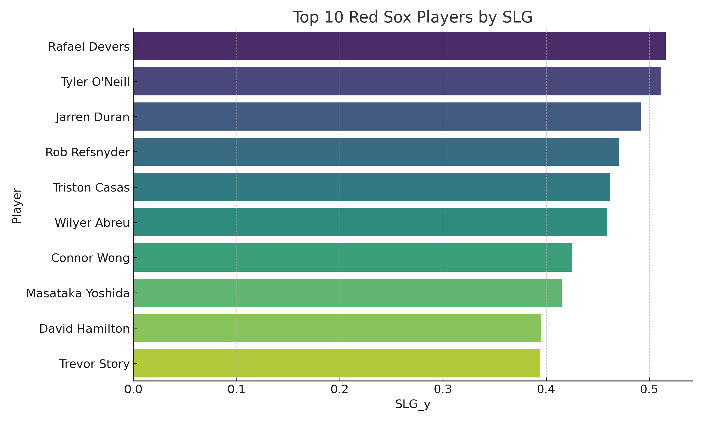
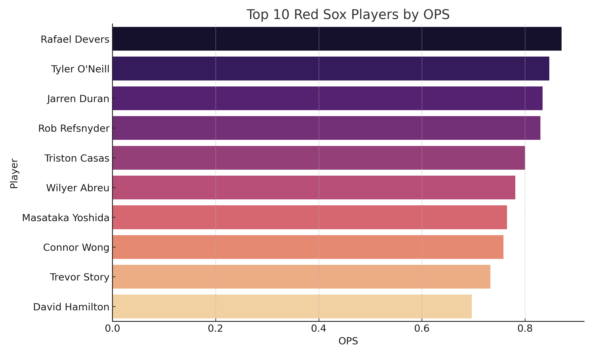
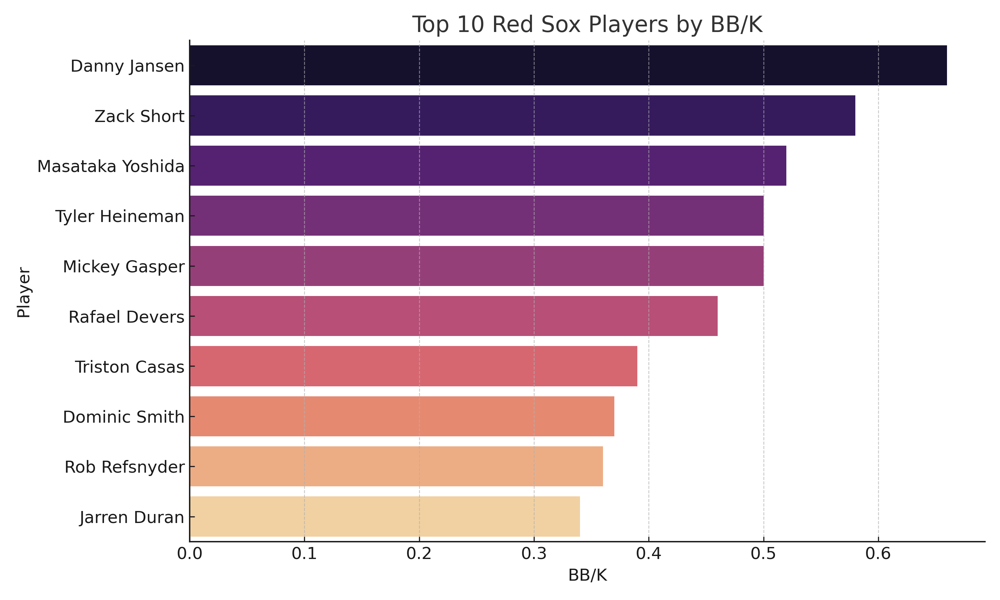
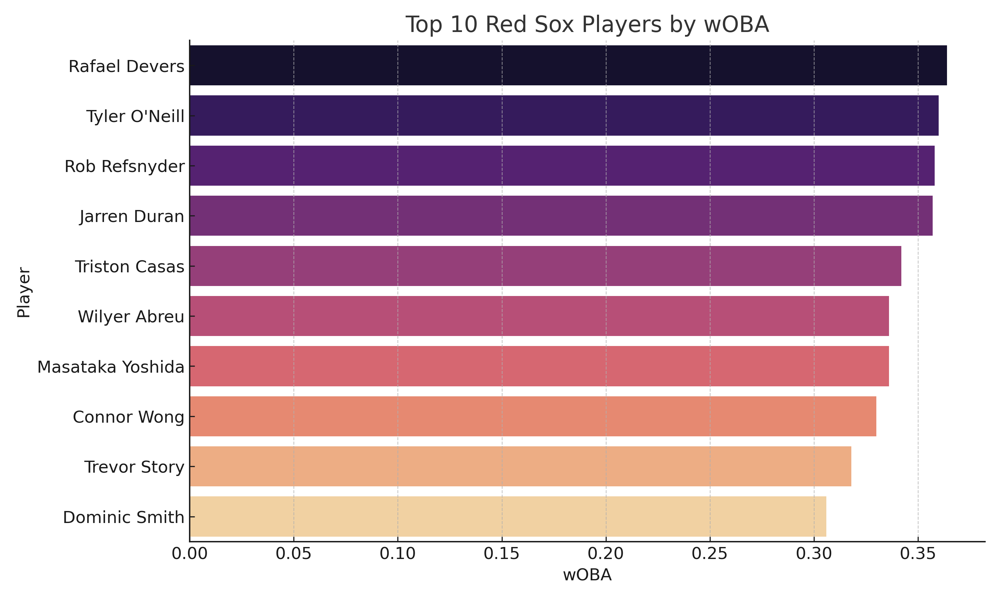
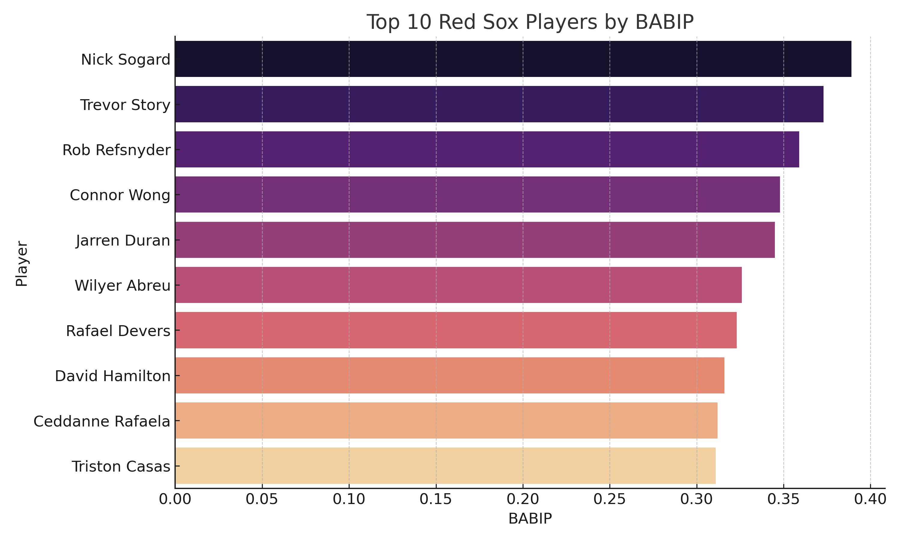
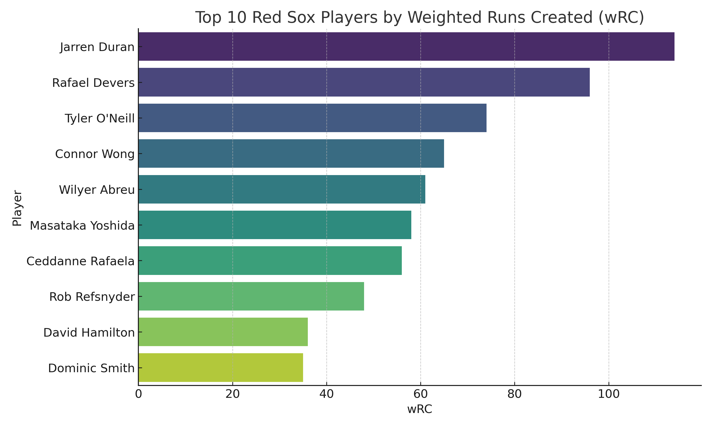

  

<h1 align="center">
  ⚾️ Boston Red Sox 2024 - Exploratory Data Analysis
</h1>

  <b>Moneyball-style breakdown of the 2024 Sox using advanced stats & interactive Python charts</b>

---

## 📊 Overview

Combining a curated Excel dataset of Red Sox batters with **advanced stats pulled using [pybaseball](https://github.com/jldbc/pybaseball)**, this project uses Python and Plotly to analyze:

- Offensive efficiency
- Plate discipline
- Sabermetric value (WAR, wOBA, etc.)
- Underrated vs overrated players
- Visual storytelling of team performance

---

## 📁 Data Sources

- 📝 **Excel File**: Manual player batting data (AB, AVG, HR, RBI, etc.)
- 🧠 **pybaseball API**: WAR, wRC+, BB/K, RC, wOBA, BABIP, FIP, and more

---

## 🔍 Key Visualizations & Insights

### 1. 🎯 WAR vs Home Runs (Interactive)
> 💡 A WAR over 2.0 = solid starter. Over 5.0 = All-Star level. WAR includes defense, base running, and clutch moments.

### 2. 🧠 Walk % vs Strikeout % (Interactive)
> 💡 BB% > 10% = elite discipline | K% < 20% = great contact control.

### 3. 📊 Bar Charts for Key Metrics

### Top10 War

💡 **WAR Insight**: 2+ = solid starter. 5+ = All-Star. 8+ = MVP tier.

### Top10 Obp

💡 **OBP Insight**: .320 is average. .360+ is excellent at getting on base.

### Top10 Slg Chart

💡 **SLG Insight**: .400 is average. .500+ = power hitter.

### Top10 Ops

💡 **OPS Insight**: .750 is average. .850+ = very productive hitter.

### Top10 Bb K

💡 **BB/K Insight**: >0.5 is good. 1.0+ = elite discipline.

### Top10 Rc

💡 **RC Insight**: Measures runs created. Higher = more valuable offensively.

### Top10 Woba

💡 **wOBA Insight**: .320 is average. .370+ = elite hitter.

### Top10 Babip

💡 **BABIP Insight**: .300 = average. Higher = good contact or luck.

### Top10 Fip

💡 **FIP Insight**: 4.00 = avg. <3.50 = very good.

### Top10 Wrc Chart

💡 **wRC Insight**: Weighted runs created. Higher = better overall offense.

---

## 🧰 Tools & Libraries

- `pandas`, `numpy`
- `seaborn`, `matplotlib`
- `plotly` (for interactivity)
- `pybaseball` (for real MLB stat scraping)
- Google Colab

---

## 🛠 How to Use

1. Upload or modify `RedSox_2024_Batting_Stats.xlsx`
2. Run the notebook in Google Colab
3. Visuals generate automatically with insights and interactivity

---

## 👩‍💻 Author

**Katie Pleasley**  
Lover of baseball data, sabermetrics, and telling stories with stats ⚾️📊

---

## 🚀 Future Enhancements

- Add pitching and fielding stats side-by-side
- Compare to league average or league percentile
- Deploy a full dashboard (Streamlit or Dash)
- Predictive modeling using scikit-learn

---

## 🌟 Like This?

Give it a ⭐ on GitHub and share with fellow Red Sox fans or baseball data nerds!
